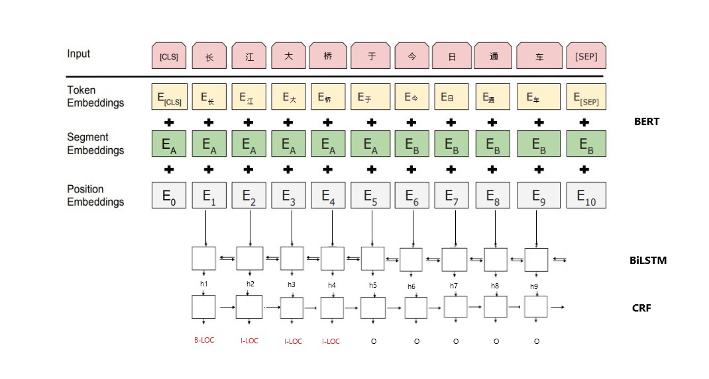

<h1 align="center">Chinese Named Entity Recognition</h1>

Tensorflow solution of named entity recognition task using [Google AI's pre-trained BERT model](https://github.com/google-research/bert).

<h2 align="center">What is BERT</h2>

BERT is a NLP model developed by Google for pre-training language representations. It leverages an enormous amount of plain text data publicly available on the web and is trained in an unsupervised manner. Pre-training a BERT model is a fairly expensive yet one-time procedure for each language. Fortunately, Google released several pre-trained models where [you can download from here](https://github.com/google-research/bert#pre-trained-models).

Using BERT has two stages: *Pre-training* and *fine-tuning*.

**Pre-training** is fairly expensive (four days on 4 to 16 Cloud TPUs), but is a one-time procedure for each language. Google released a number of pre-trained models from the paper [BERT: Pre-training of Deep Bidirectional Transformers for Language Understanding](https://arxiv.org/pdf/1810.04805.pdf) which were pre-trained at Google.

**Fine-tuning** is inexpensive. All of the results in the paper can be replicated in at most 1 hour on a single Cloud TPU, or a few hours on a GPU, starting from the exact same pre-trained model. SQuAD, for example, can be trained in around 30 minutes on a single Cloud TPU to achieve a Dev F1 score of 91.0%, which is the single system state-of-the-art.

The other important aspect of BERT is that it can be adapted to many types of NLP tasks very easily. In the paper mentioned above, they demonstrate state-of-the-art results on sentence-level (e.g., SST-2), sentence-pair-level (e.g., MultiNLI), word-level (e.g., **NER**), and span-level (e.g., SQuAD) tasks with almost no task-specific modifications.


<h2 align="center">How to train</h2>

#### 1. Download a Pre-trained BERT Model
Download the pretrained model for Chinese [here](https://storage.googleapis.com/bert_models/2018_11_03/chinese_L-12_H-768_A-12.zip), then uncompress the zip file into this path:`/tmp/DI4Text/diModules/ChineseNER/chinese_L-12_H-768_A-12/`

#### 2. Add Dataset
Put train/dev/test dataset in this path: `/tmp/DI4Text/diModules/ChineseNER/NERdata/`. The file name of the train/dev/test dataset should be `train.txt`, `dev.txt`, `test.txt`. The [format of dataset](#dataset-format) will be introduced later. 

#### 3. Add Labels
In the file `/tmp/DI4Text/diModules/ChineseNER/config.ini`, `label_list` specifies the named entity labels. Modify the label list based on your dataset. 

:bulb:**Note**: The labels should be splitted by '`,`'.For example, there are three labels `PER`, `ORG`, `LOC` in the training dataset, then `label_list` should be `PER,ORG,LOC`.

#### 4. Train model
`training.py` is the entrypoint for training. Run 
```python
python training.py
```
The fine-tuned model will be stored at `/tmp/DI4Text/diModules/ChineseNER/output/`.

If you look into `/tmp/DI4Text/diModules/ChineseNER/output/`, it contains something like:
```bash
checkpoint                                        128
entity_level_predicted_result.txt                 1.0K
eval.tf_record                                    219K
events.out.tfevents.1545202214                    6.1M
graph.pbtxt                                       9.0M
label_list.pkl                                    1K
label_test.txt                                    2374K
label2id.pkl                                      1K
model.ckpt-0.data-00000-of-00001                  1.3G
model.ckpt-0.index                                23K
model.ckpt-0.meta                                 3.9M
model.ckpt-500.data-00000-of-00001                1.3G
model.ckpt-500.index                              23K
model.ckpt-500.meta                               3.9M
predict.tf_record                                 3340K
token_test.txt                                    1208K
train.tf_record                                   2.0M
```

One may get `model.ckpt-123.data-00000-of-00001` or `model.ckpt-9876.data-00000-of-00001` depending on the total training steps). Now we have collected all three pieces of information that are needed for serving this fine-tuned model:
- The pretrained model is downloaded to `/tmp/DI4Text/diModules/ChineseNER/chinese_L-12_H-768_A-12/`
- Our fine-tuned model is stored at `/tmp/DI4Text/diModules/ChineseNER/output/`;
- Our fine-tuned model checkpoint is named as `model.ckpt-500`.

#### 5. Evaluate the model

The prediction result on the test dataset will be evaluated using `/tmp/DI4Text/diModules/ChineseNER/colleval.py`, and the evaluation result will be stored in `/tmp/DI4Text/diModules/ChineseNER/output/entity_level_predicted_result.txt`.

This is the result on the dataset `SIGHAN Bakeoff 2006` for NER task. The measures that will be reported are precision, recall, and FB1. :

```bash
processed 214490 tokens with 7450 phrases; found: 7418 phrases; correct: 6737.
accuracy:  99.10%; precision:  90.82%; recall:  90.43%; FB1:  90.62
              LOC: precision:  92.15%; recall:  90.88%; FB1:  91.51  3416
              ORG: precision:  84.26%; recall:  85.27%; FB1:  84.76  2192
              PER: precision:  96.24%; recall:  95.71%; FB1:  95.98  1810
```

:bulb:**Note**: The labels should be in the format `X-LABEL`, e.g. `B-LOC`, `I-GPEC`. `colleval.py` cannot deal with other label formats.

<h2 align="center">How to predict</h2>

`main.py` is the entrypoint for the prediction. Run 
```bash
python main.py -m /path/to/output -o /path/to/result.xlsx /path/to/input.txt
```
* `/path/to/output`: Specify the path to the directory containing the model files. For instance `/tmp/DI4Text/diModules/ChineseNER/output/`

* `/path/to/result.xlsx`: Specify the path to the Excel file which will contain the analysis results. Note: If the file already exists and cannot be overwritten, a temporary file will be created instead. Check the console log to find which file was actually written.

* `/path/to/input.txt`: Specify the path to the file which contains the text you want to be predicted.

<h2 align="center" id="dataset-format">Dataset Format</h2>

Train/dev/test dataset should be in this format:
```
海 O
钓 O
比 O
赛 O
地 O
点 O
在 O
厦 B-LOC
门 I-LOC
与 O
金 B-LOC
门 I-LOC
之 O
间 O
的 O
海 O
域 O
。 O
```
*   There are two characters in each line: the first character is the token, the second is the label of the token. These two characters are separated by a space.
*   The sentences are separated by a blank line. 
*   The length of each sentence could not exceed [max_seq_length](#max_seq_length). If the length of one sentence is longer than the maximum value, the exceeded part of the sentence will be ignored.
*   :bulb:**Note**: The labels should be in the format `X-LABEL`, e.g. `B-LOC`, `I-GPEC`. Other label format can be used to do the training, testing and prediction, but the evaluation cannot be processed properly.
*   :bulb:**Note**: The first line could not be blank; there should be only one blank line after the last sentence.

<h2 align="center" id="hyperparameter">Hyperparameters</h2>

Hyperparameters are stored in `/tmp/DI4Text/diModules/ChineseNER/config.ini`.

| Argument | Type | Default | Description |
|--------------------|------|-------------|----------------------------------------------------------------------------------------------------------------------------------------------------------------|
| `task_name` | str | ner | The name of the task to train. |
| `do_lower_case`| bool |True| Whether to lower case the input text. |
| <span id="max_seq_length">`max_seq_length`</span>| int | 128 | The maximum total input sequence length. |
| `clean` | bool | True | Remove the files which created by last training. |  
| `do_train` | bool | True | Whether to run training. |
| `do_eval` | bool | True | Whether to run eval on the dev set. |
| `do_predict` | bool | True | Whether to run the model in inference mode on the test set. |
| `batch_size` | int | 128 | Total batch size. |
| `train_batch_size` | int | 128 | Total batch size for training. |
| `eval_batch_size` | int | 64 | Total batch size for eval. |
| `predict_batch_size` | int | 64 | Total batch size for predict. |
| `learning_rate` | float | 8e-6| The initial learning rate for Adam. |
| `num_train_epochs` | int | 2 | Total number of training epochs to perform. |
| `dropout_rate` | float | 0.5 | Dropout rate |
| `clip` | float | 5 | Gradient clip |
| `warmup_proportion` | float | 0.1 | Proportion of training to perform linear learning rate warmup for. E.g., 0.1 = 10% of training.|
| `save_summary_steps` | int | 500 | How often to save the model summary. |
| `save_checkpoints_steps` | int | 500 | How often to save the model checkpoint. |
| `iterations_per_loop` | int | 1000 | How many steps to make in each estimator call. |
| `cell` | list | lstm | Which rnn cell used, valid values are `lstm` and `gru`.|
| `lstm_size` | int | 128 | Size of lstm units. |
| `num_layers` | int | 2 | Number of rnn layers. | 

<h2 align="center" >Neural Network Structure</h2>
For a given token, its input respresentation is constructed by summing the corresponding token, sement, and position embeddings. The character-level embeddings are the output of BERT. These embeddings are used as the input of the corresponding slot in the bidirectional LSTM. In turn, the output of the Bi-LSTM slot is noted as hi and used as input for the CRF. Eventually, the CRF slot emits prediction of labels. Token “长” is the 1-th token in the sentence and is predicted as “B-LOC”.


